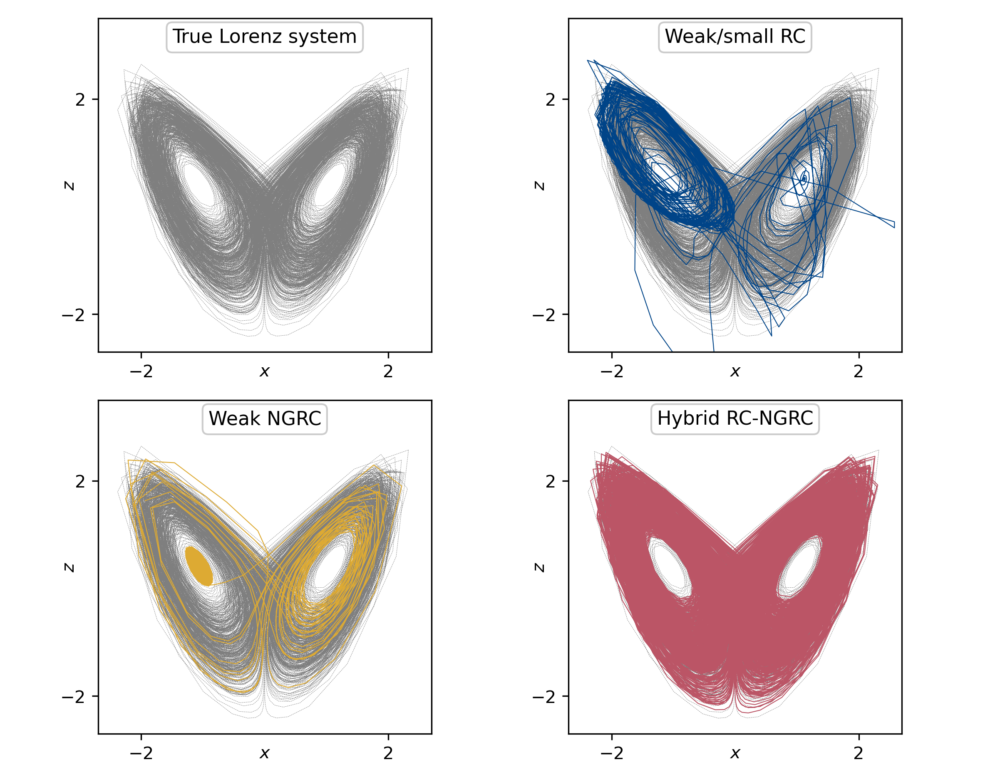

# Hybrid RC NGRC
This repository contains the code supporting the findings of our paper "Hybridizing Traditional and Next-Generation Reservoir Computing to Accurately and Efficiently Forecast Dynamical Systems" ([journal link](https://doi.org/10.1063/5.0206232), [arXiv](https://arxiv.org/abs/2403.18953)).

<!--  -->


## Usage

Begin by creating and activating a conda environment with the necessary requirements specified in `environment.yml`:
```
conda env create --file environment.yml --name hybrid_rc_ngrc_environment

conda activate hybrid_rc_ngrc_environment
```
(replace `hybrid_rc_ngrc_environment` with desired environment name). Notably, we use the [dysts](https://github.com/williamgilpin/dysts) package (v0.1) to generate trajectories of chaotic systems.

Example scripts can be run as follows:
```
python examples/simple_example_lorenz.py
```
At this time, `simple_example_lorenz.py` and `VPT_distribution_lorenz.py` are known to work well; other example scripts may be incomplete and/or may demand significant computing power and memory resources to execute.

## Other dynamical systems

To experiment with dynamical systems other than the Lorenz, Rössler, Double Scroll, or Mackey Glass systems, you must pre-generate a long trajectory of that dynamical system so that random initial conditions can be sampled from the attractor. To do so, modify the main function of `hybrid_rc_ngrc/long_trajectory.py` to include the desired dynamical system from the dysts package, and run the script.